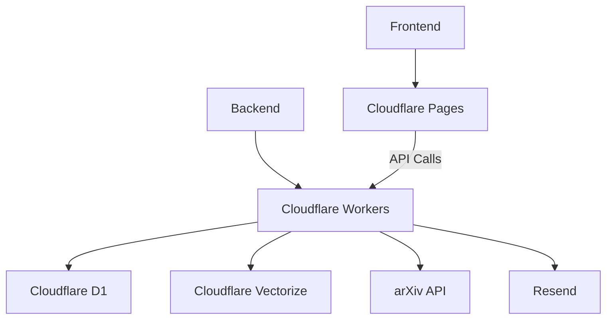

# Plan for Your Next-Gen arXiv Monitoring App

This document refines the high-level **Core Value Proposition**, **Key Features**, and **Differentiation Strategy** into a **step-by-step** development plan, including technical architecture and workflow guidelines. The goal is to build a Cloudflare-native web application that lets users define personalized interest profiles—via structured filters or natural language prompts—and receive curated arXiv updates, advanced semantic filtering, and team collaboration features.

---

## 1. Core Value Proposition

> A personalized research monitoring system where users define their intellectual interests through **natural language prompts** and **structured filters** to receive curated arXiv updates. Additional premium features include **AI-assisted paper analysis**, advanced notifications, and collaborative knowledge dashboards.

---

## 2. High-Level Feature Overview

### 2.1 Interest Profile System
1. **Guided Prompt Templates**  
   - Pre-built templates for different user personas (Academic Researcher, Industry Practitioner, etc.).  
   - Users can quickly jump-start their filter configurations.

2. **Dynamic Filter Builder**  
   - Combines arXiv category pickers (e.g., `cs.AI`, `stat.ML`) with freeform keywords, exclusion lists, and optional citation alerts.

3. **Prompt Playground**  
   - Users can test and refine their prompts.  
   - Real-time preview of papers matched.  
   - Save multiple “profiles” (e.g., “PhD Focus” vs. “Side Project”).

### 2.2 Recommendation Engine
- **Three-Stage Filtering**:
  1. **Structural Filter**: Basic category + keyword matching.  
  2. **Semantic Filter**: LLM-based scoring of how well a paper aligns with the user’s custom “prompt.”  
  3. **Recency Boost**: Highlights trending or newly published papers that fit the user’s interest profile.

### 2.3 Notification System
- **Custom Delivery Preferences**:
  - Channels: Email, Telegram, Discord webhook.  
  - Smart Summaries: Summaries show relevance scores, short highlights, and direct links to the user’s “Library” or the original PDF.  
  - Scheduling: “Send digest when 5+ relevant papers accumulate,” daily, or weekly.

### 2.4 Knowledge Dashboard
1. **Paper Discovery**  
   - Tinder-like swiping to quickly keep or mute specific topics.  
   - Social proof indicators (e.g., “12 ML engineers saved this paper”).

2. **Research Library**  
   - Auto-organization by application, method, or timeline.  
   - User can star or annotate papers.

3. **Insight Tracking**  
   - Weekly report on emerging keywords, most-cited papers, and top collaborators.

### 2.5 Differentiation Strategy
Compared to simpler “arxiv-daily” tools, this platform offers:
- **Cloud-synced user profiles**  
- **Visual multi-prompt editor**  
- **Collaboration** (team libraries, shared notes)  
- **ML-powered recommendation memory**  
- **Multi-channel delivery** (beyond email)

### 2.6 Monetization Model
- **Freemium**: Limited profiles, basic filters, daily email.  
- **Pro ($15/mo)**: Unlimited profiles, advanced features (AI chat, Slack/Discord integration).  
- **Teams ($99/mo)**: Shared libraries, annotation tools, collaborative analytics.

---

## 3. Core Architecture

Below is an example Cloudflare-native design:



1. **Frontend** runs on Cloudflare Pages, built with a modern React + Vite setup (or Next.js if you prefer).
2. **Backend** logic is handled by Cloudflare Workers (Hono.js framework).  
3. **Database** is Cloudflare D1 (SQL).  
4. **Vector Store** (for semantic search and RAG) uses Cloudflare Vectorize (future addition).  
5. **arXiv API** integration for fetching paper data.  
6. **Resend** or similar email service handles notifications.

---

## 4. Tech Stack Breakdown

### 4.1 Frontend (Cloudflare-Optimized)
- **Framework**: React (with Vite or Next.js, depending on preference)  
- **State Management**: Zustand or TanStack Query for server state  
- **UI Components**: [shadcn/ui](https://ui.shadcn.com/) (Tailwind-based)  
- **Routing**: TanStack Router (or Next.js App Router)  
- **Authentication**: [Lucia Auth](https://lucia-auth.com/) or a Cloudflare-compatible alternative  
- **Build Tool**: Vite (or Next.js with a custom build config)

### 4.2 Backend (Cloudflare Native)
- **Runtime**: [Hono.js](https://hono.dev/) on Cloudflare Workers  
- **Database**: [Cloudflare D1](https://developers.cloudflare.com/d1/) + [Drizzle ORM](https://orm.drizzle.team/) for schema migrations  
- **Auth**: Lucia Auth + Turnstile (Cloudflare’s CAPTCHA) for bot protection  
- **Notifications**: [Resend](https://resend.com/) or custom email provider integration  
- **LLM / Semantic Search**:  
  - Option A: Cloudflare Vectorize (in Beta) for embeddings + Pinecone-like usage  
  - Option B: Use external embeddings (OpenAI) + store in D1 or KV

### 4.3 Shared Infrastructure

```bash
my-app/
├── backend
│   ├── src
│   │   ├── modules        
│   │   │   ├── auth       # Auth workflows 
│   │   │   ├── papers     # arXiv integration
│   │   │   ├── alerts     # Notification logic
│   │   │   └── semantics  # LLM scoring & vector indexing
│   │   ├── drizzle        # DB migrations/queries
│   │   └── index.ts       # Hono.js worker entry
├── frontend
│   ├── src
│   │   ├── modules
│   │   │   ├── auth       # Login/Profile
│   │   │   ├── feed       # Paper recommendations  
│   │   │   ├── settings   # Alert configuration
│   │   │   └── library    # Saved papers & insights
│   │   └── lib
│   │       └── apiClient  # Hono/Fetch wrappers for typed RPC
└── package.json
```

---

## 5. Step-by-Step Development Plan

Below is a suggested task breakdown using **GitHub Issues** and **Pull Requests**. After each completed step, merge into `main` only after testing:

### 5.1 Initialize Cloudflare Pages & Workers

- **Issue #1**: “Set Up Cloudflare Project & Repo”
  1. Create a new GitHub repository.  
  2. Configure Cloudflare Pages project for the **frontend** and Workers for the **backend**.  
  3. Ensure basic “Hello World” runs on both.  
  4. Add initial README.

- **Issue #2**: “Install & Configure Hono, Drizzle, Lucia Auth (Backend)”
  1. Add Hono.js to the Workers code.  
  2. Set up Drizzle for D1 migrations (`drizzle/schema/*.ts`).  
  3. Integrate Lucia for authentication scaffolding.  
  4. Verify local development with `wrangler dev` or `npm run start`.

### 5.2 Database & User Model

- **Issue #3**: “Create Basic User Schema & Migration”
  1. Define `users` table with columns for `id`, `email` (unique), `name`, `authId`, timestamps.  
  2. Migrate using Drizzle to D1.  
  3. Write minimal tests (with [Vitest](https://vitest.dev/)) to confirm user creation works.

### 5.3 Frontend Setup & Auth Flow

- **Issue #4**: “Add React Frontend with Tailwind, Basic Auth Pages”
  1. Initialize React + Vite (or Next.js) in `/frontend`.  
  2. Install Tailwind, configure for theming.  
  3. Build a simple “Login / Signup” page, hooking into Lucia Auth (via an API route in Hono).  
  4. Test user registration end to end.

### 5.4 Interest Profile System

- **Issue #5**: “Design & Implement Prompt Playground & Filter Builder”
  1. Create a `user_interests` table (`userId`, `prompt`, `categories`, etc.).  
  2. Provide a React UI (wizard or multi-step form) to create/edit interest profiles.  
  3. Display a real-time preview (mock data or limited arXiv API calls) to show matching results.  
  4. Write component tests (Vitest + React Testing Library).

### 5.5 ArXiv Integration & Paper Ingestion

- **Issue #6**: “Implement arXiv Polling & Paper Storage”
  1. Set up a Worker CRON or scheduled job to fetch new arXiv papers daily (by category).  
  2. Store minimal paper metadata in a `papers` table.  
  3. Write logic to match papers to user interest filters (structural only, for now).  
  4. Add tests mocking arXiv responses.

### 5.6 Recommendation Engine (Semantic Filtering)

- **Issue #7**: “Add LLM Scoring & Vector Storage”
  1. For each paper, generate embeddings (OpenAI or Cloudflare Vectorize).  
  2. Compare embeddings with user’s prompt embeddings to produce a relevance score.  
  3. Merge structural + semantic scores for final ranking.  
  4. Provide a route to retrieve the top N relevant papers for each user.

### 5.7 Notification System

- **Issue #8**: “User Alerts & Summaries”
  1. Let users set frequency (daily, weekly, threshold-based).  
  2. Use a scheduled Worker to gather relevant papers since the last notification.  
  3. Send via Resend (or other email provider), or post to Telegram/Discord.  
  4. Write test coverage for the alert aggregator function.

### 5.8 Knowledge Dashboard

- **Issue #9**: “Build Discovery & Library Features”
  1. **Discovery**: “Swipe” interface or simple ‘approve/reject’ UI for recommended papers.  
  2. **Library**: Saved papers automatically grouped by method, date, or user tags.  
  3. **Analytics**: Weekly summary of top-cited or trending items in the user’s feed.  
  4. Tests: React component tests (ensure correct grouping, filtering, etc.).

### 5.9 Premium Features (AI Chat, Team Collab)

- **Issue #10**: “Introduce Subscriptions & AI Chat”
  1. Payment integration (Stripe, Paddle, or custom).  
  2. Gated access to advanced features:
     - AI Chat: Q&A on the PDF text or summarization.  
     - Team libraries, shared annotations.  
  3. Test thoroughly, especially the chat logic (mock LLM API calls).

### 5.10 Final Polishing & Deployment

- **Issue #11**: “UI Cleanup, Performance Tuning & Launch”
  1. Apply a cohesive design system using Tailwind (dark mode, responsive views).  
  2. Optimize your Worker and D1 queries (indexes, caching).  
  3. Run final regression tests.  
  4. Update docs, finalize your `README`, and confirm production deployment on Cloudflare Pages/Workers.

---

## 6. Project Strategy & Guidelines

1. **Incremental Development**  
   - Each of the above steps corresponds to a GitHub Issue (or group of issues).  
   - Keep feature branches small and focused.

2. **GitHub Repo & Workflow**  
   - **Create** GitHub Issues describing tasks.  
   - **Branch** off `main` for each feature.  
   - **Implement** & **Test** locally with `npm run dev` and `npm run test`.  
   - **Pull Request** → **Review** → **Merge** → **Pull** new `main`.

3. **Testing with Vitest**  
   - Use Vitest for both server logic (Hono routes, Drizzle queries) and React component tests.  
   - Example tests:
     - Creating a user with a unique email.  
     - Fetching & storing new arXiv papers.  
     - Rendering the feed & ensuring correct sorting by “relevance.”

4. **Deployment**  
   - Use **wrangler** to deploy the Worker.  
   - Connect Cloudflare Pages for the frontend build.  
   - Ensure D1 migrations run on production environment.  
   - Validate the entire pipeline end to end.

5. **Sub-Agent / Issue-PR Workflow**  
   - If delegating tasks, assign Issues to sub-agents with clear acceptance criteria.  
   - They open a PR, pass tests, and await review.  
   - Merge once approved.

6. **Frequent Commits & Merges**  
   - Maintain a short feedback loop.  
   - Avoid large, monolithic PRs.

---

## 7. Conclusion

By following this **technical roadmap** and **agentic issue/PR workflow**, you will:

- Develop a **Cloudflare-native** system (Workers + D1) for capturing user interest profiles, polling arXiv, and delivering curated recommendations.  
- Integrate an **LLM-based** semantic filter and eventually an **AI chat** feature for deeper interaction with the research content.  
- Support **collaborative** and **team-based** usage, aligning with your monetization strategy.  

This plan ensures that each feature is thoroughly tested, incrementally built, and aligned with your overarching vision for a **personalized research monitoring** platform.